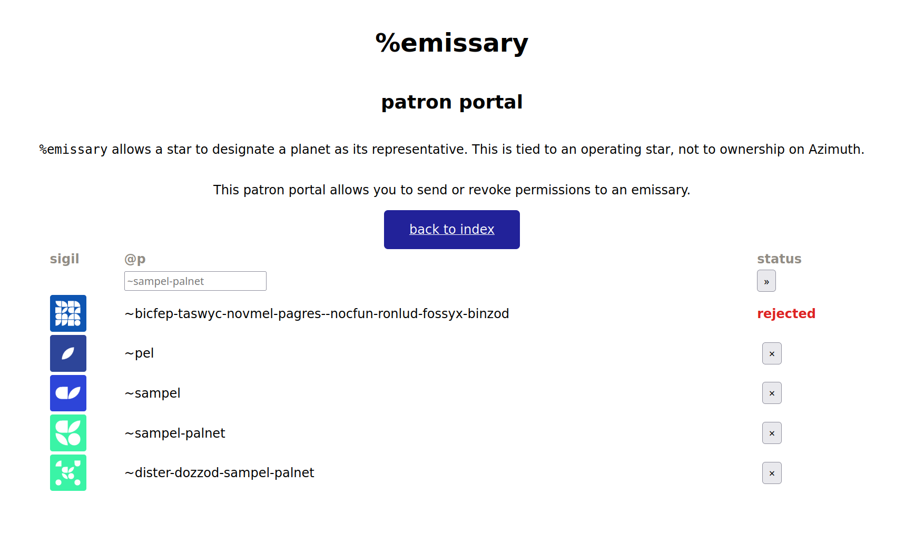
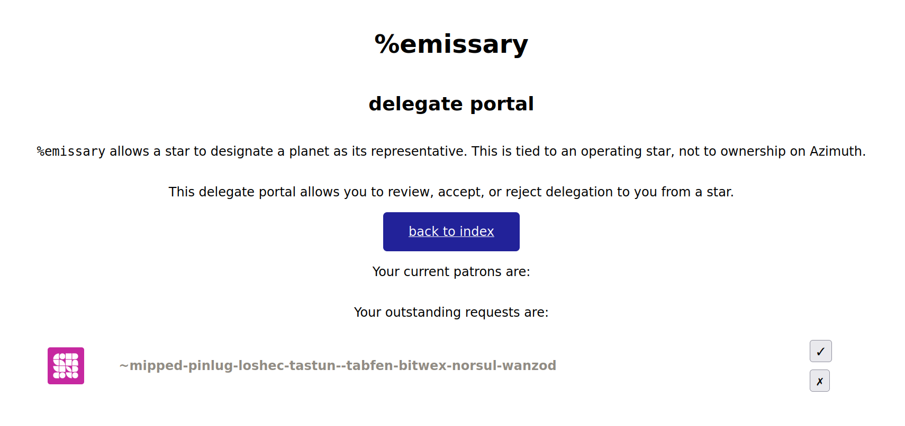

#   `%emissary`

`%emissary` allows a running star to designate a planet as its representative.  (This is tied to operation not merely to ownership.)  The app is served at `/app/emissary`.

`%emissary` allows app developers to permit delegate planets to exercise star-related powers and privileges.  It can be used for arrangements beyond this, however.


There are three roles one can play with respect to `%emissary`:

1. **Patron**.  A point (typically a point on a tier heavier in the address space, such as a galaxy or star) will designate a delegate (commonly a star or planet).  A patron exposes a public attestation of the delegation to remote scry.
2.  **Delegate**.  A point (typically a point lighter in the address space, such as a star or planet) will act as a delegae of a patron (commonly a galaxy or star).  A delegate exposes a public attestaion of the delegation to remote scry.
3.  **Observer**.  A third-party app or point wishes to verify whether two points are in a patronage relationship.  This observer must periodically remote scry **both** points for agreement.

#### Prior Art

- [`~hanfel-dovned/bless`](https://github.com/hanfel-dovned/Bless)
- [`~paldev/pals`](https://github.com/fang-/suite/)

Special thanks to ~paldev for `/lib/rudder` and to ~midden-fabler for `%ahoy` (code from which was coopted here for breach detection).

`%emissary` is available under the MIT License.


##  Usage

### Installation

Install over the wire from ~magbel.

```hoon
|install ~magbel %emissary
```

Install from source by cloning this repository then copying the contents of the `desk/` directory into your ship as usual.

```sh
git clone https://github.com/sigilante/emissary.git
yes | cp -r emissary/desk/* zod/emissary
```

### Patron

The patron is responsible to send a request to another point for 
that point to act as its delegate.

Delegation may be managed through the patron portal online or 
using CLI generators:

```hoon
:emissary|designate ~sampel-palnet
:emissary|revoke ~sampel-palnet
```

Served at `/app/emissary/patron`.



### Delegate

The delegate-designee may review and either accept or reject 
requests from other points to serve as their delegate.

Delegation may be managed through the delegate portal online or 
using CLI generators:

```hoon
:emissary|accept ~sampel
:emissary|reject ~sampel
```

Served at `/app/emissary/delegate`.



### Observer

An observer may query whether a point has any delegates or any patrons.

Served at `/app/emissary/observer`.

#### Local Scries

```hoon
:: Get set of all confirmed delegates.
.^((set @p) %gy /=emissary=/delegates)
:: Get set of all pending outgoing requests.
.^((set @p) %gy /=emissary=/outgoing)
:: Get set of all pending incoming requests.
.^((set @p) %gy /=emissary=/incoming)
:: Get set of all confirmed patrons.
.^((set @p) %gy /=emissary=/patrons)

:: Check status of single delegate claim.
.^(? %gx /=emissary=/delegate/~sampel-palnet/emissary-demand)
:: Check status of single patron claim.
.^(? %gx /=emissary=/patron/~sampel-palnet/emissary-demand)
```

#### Remote Scries

The following scry endpoints are bound (with appropriate revision
number and the same types as above):

```hoon
:: Get set of all confirmed delegates.
/g/x/0/emissary//delegates
:: Get set of all pending outgoing requests.
/g/x/0/emissary//outgoing
:: Get set of all pending incoming requests.
/g/x/0/emissary//incoming
:: Get set of all confirmed patrons.
/g/x/0/emissary//patrons

:: Check status of single delegate claim.
/g/x/0/emissary//delegate/~sampel-palnet
:: Check status of single patron claim.
/g/x/0/emissary//patron/~sampel-palnet
```

You can request one of these values at the current time using a 
`%keen` task (without the double `//`):

```hoon
[%pass /emissary/fine %arvo %a %keen ~sampel-palnet /g/x/0/emissary/delegate/~sampel]
```

If the target ship has participated in `%emissary`, then that task
will trigger the return of a `%tune` gift of the form:

```hoon
[%tune [~sampel-palnet /emissary/fine] `roar]
```

The `+$roar` will contain the remote scry path and the value in 
its head.  (The tail is the signature.)  That head:

```hoon
[/g/x/0/emissary/delegate/~sampel [~ %.y]]
```

You can (locally) check currently bound scry paths thus:

```hoon
> .^(* %gx /=emissary=//patron/~zod)
0

> ;;([%patron ?] .^(* %gx /=emissary=//patron/~zod))
[%patron %.n]

> .^((set @p) %gy /=emissary=/incoming)
{~zod}

> .^((list path) %gt /=emissary=//patron)
~[/patron/~zod]

> .^([%ud @ud] %gw /=emissary=//patrons)
[%ud 11]
```

A third-party agent should be careful to use the latest revision 
of the delegation.  It remains to decide what is a good interval 
for this attestation to remain valid (i.e. if a star is taken 
offline).  We also need to produce a library core to facilitate 
checking both points easily.


##  Code

### `/sur/emissary`

The major data structures include:

- `+$  trigger` for a patron to decide about a delegate.
- `+$  request` for a parton to send to a delegate.
- `+$  decide` for a delegate to decide about a patron.
- `+$  response` for a delegate to reply to a patron.
- `+$  demand` represents responses to scries (local and remote).

Canonically, `trigger` → `request` → `decide` → `response`.

You may use the `/mar/emissary/demand` file to properly process
a response to a marked scry.

### `/gen/emissary/*`

- `+accept` for a delegate to accept a patron.
- `+designate` for a patron to request a delegate.
- `+reject` for a delegate to refuse a patron.
- `+revoke` for a patron to unrequest a delegate.

### `/app/emissary/webui/*`

`%emissary` uses `/lib/rudder` to present its browser interface.


##  Changelog

- `[1 0 0]` initial release, local scry only
- `[1 1 0]` add support for remote scry; reorganize actions; adjust scry paths; add observer page
- `[1 1 1]` adjust CSS
- `[1 2 0]` hotfix remote scry on livenet; rework query data structure
- `[1 3 0]` tombstone stale remote scry endpoints
- `[1 4 0]` remove patrons and delegates on breach notification
- `[1 4 1]` bump to 411 K; modify remote scry task signatures
- `[1 4 2]` modify remote scries for 411K

### Planned Work

- add observer library
- add QR code status check
