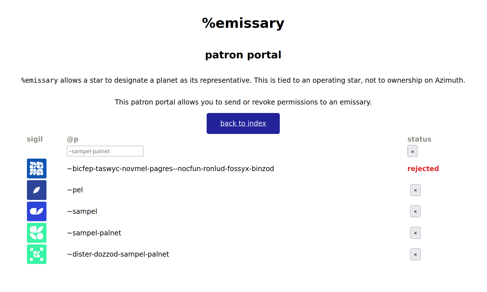
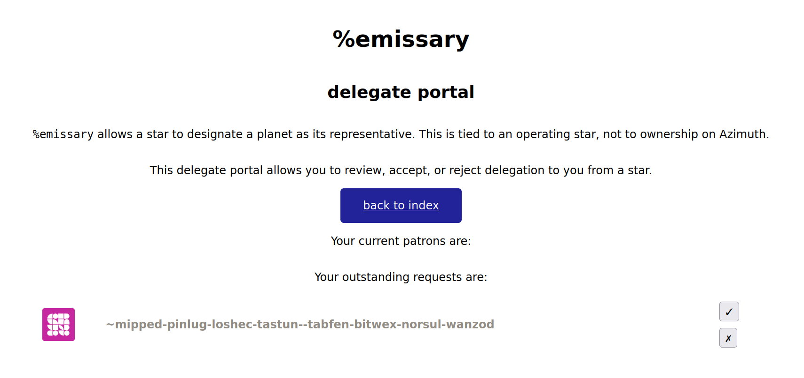

#   `%emissary`

**Status ~2026.7.17.  `%emissary` `[1 5 0]` runs on 409K/408K and has been verified end-to-end (patron → delegate → third-party observer over remote scry) on a three-fakeship harness.  The remote-scry revision-culling rework is in progress; see Planned Work.**

`%emissary` allows a running star to designate a planet as its representative.  (This is tied to operation not merely to ownership.)  The app is served at `/app/emissary`.

`%emissary` allows app developers to permit delegate planets to exercise star-related powers and privileges.  It can be used for arrangements beyond this, however.


There are three roles one can play with respect to `%emissary`:

1. **Patron**.  A point (typically a point on a tier heavier in the address space, such as a galaxy or star) will designate a delegate (commonly a star or planet).  A patron exposes a public attestation of the delegation to remote scry.
2.  **Delegate**.  A point (typically a point lighter in the address space, such as a star or planet) will act as a delegae of a patron (commonly a galaxy or star).  A delegate exposes a public attestaion of the delegation to remote scry.
3.  **Observer**.  A third-party app or point wishes to verify whether two points are in a patronage relationship.  This observer must periodically remote scry **both** points for agreement.

#### Prior Art

- [`~hanfel-dovned/bless`](https://github.com/hanfel-dovned/Bless)
- [`~paldev/pals`](https://github.com/fang-/suite/)

Special thanks to ~paldev for `/lib/rudder` and to ~midden-fabler for `%ahoy` (code from which was coopted here for breach detection).

`%emissary` is available under the MIT License.


##  Usage

### Installation

Install over the wire from ~magbel.

```hoon
|install ~magbel %emissary
```

Install from source by cloning this repository then copying the contents of the `desk/` directory into your ship as usual.

```sh
git clone https://github.com/sigilante/emissary.git
yes | cp -r emissary/desk/* zod/emissary
```

### Patron

The patron is responsible to send a request to another point for 
that point to act as its delegate.

Delegation may be managed through the patron portal online or 
using CLI generators:

```hoon
:emissary|designate ~sampel-palnet
:emissary|revoke ~sampel-palnet
```

Served at `/app/emissary/patron`.



### Delegate

The delegate-designee may review and either accept or reject 
requests from other points to serve as their delegate.

Delegation may be managed through the delegate portal online or 
using CLI generators:

```hoon
:emissary|accept ~sampel
:emissary|reject ~sampel
```

Served at `/app/emissary/delegate`.



### Observer

An observer may query whether a point has any delegates or any patrons.

Served at `/app/emissary/observer`.

#### Local Scries

All peeks produce a `+$demand` cell from `/sur/emissary` (e.g.
`[%delegates (set ship)]`), not a bare set, so scry with the
`demand` type in scope (or a `*` mold):

```hoon
> =e -build-file /=emissary=/sur/emissary/hoon

:: Get set of all confirmed delegates.
.^(demand:e %gy /=emissary=/delegates)
:: Get set of all pending outgoing requests.
.^(demand:e %gy /=emissary=/outgoing)
:: Get set of all pending incoming requests.
.^(demand:e %gy /=emissary=/incoming)
:: Get set of all confirmed patrons.
.^(demand:e %gy /=emissary=/patrons)

:: Check status of single delegate claim.
.^(demand:e %gx /=emissary=/delegate/~sampel-palnet/emissary-demand)
:: Check status of single patron claim.
.^(demand:e %gx /=emissary=/patron/~sampel-palnet/emissary-demand)
```

#### Remote Scries

The following scry endpoints are bound (revisions are numbered
from 1, with the same `+$demand` types as above):

```hoon
:: Get set of all confirmed delegates.
/g/x/<case>/emissary//1/delegates
:: Get set of all pending outgoing requests.
/g/x/<case>/emissary//1/outgoing
:: Get set of all pending incoming requests.
/g/x/<case>/emissary//1/incoming
:: Get set of all confirmed patrons.
/g/x/<case>/emissary//1/patrons

:: Check status of single delegate claim.
/g/x/<case>/emissary//1/delegate/~sampel-palnet
:: Check status of single patron claim.
/g/x/<case>/emissary//1/patron/~sampel-palnet
```

`<case>` must be fully qualified: either a revision number
(`%ud`, numbered from 1 — a request for an unbound revision waits
until it is bound) or a date (`%da`, answered with the latest
revision as of that date).  Request a value through Gall's `%keen`
task, which normalizes the response regardless of wire protocol:

```hoon
[%pass /emissary/fine %keen %.n ~sampel-palnet /g/x/(scot %da now.bowl)/emissary//1/delegates]
```

If the target ship has participated in `%emissary`, the response
arrives in `+on-arvo` as a `%sage` sign:

```hoon
[%ames %sage [~sampel-palnet /g/x/.../emissary//1/delegates] gage]
```

where `+$gage:mess:ames` is `$@(~ page)`: `~` for an absent or
tombstoned value, or a `page` such as
`[%emissary-demand [%delegates (set ship)]]`.

You can (locally) check currently bound scry paths and revisions
thus (note the leading empty path segment before `1`, and that
`%t` lists strict prefix extensions only):

```hoon
:: All bound paths in the agent's namespace.
> .^((list path) %gt /=emissary=//1)
~[/patrons /incoming /patron/~zod]

:: Latest bound revision of a specific path.
> .^([%ud @ud] %gw /=emissary=//1/patrons)
[%ud 1]

:: Value at a specific revision.
> .^(* %gx /=emissary=//1/patron/~zod)
[7.310.021.665.986.930.032 0]
```

A third-party agent should be careful to use the latest revision 
of the delegation.  It remains to decide what is a good interval 
for this attestation to remain valid (i.e. if a star is taken 
offline).  We also need to produce a library core to facilitate 
checking both points easily.


##  Code

### `/sur/emissary`

The major data structures include:

- `+$  trigger` for a patron to decide about a delegate.
- `+$  request` for a parton to send to a delegate.
- `+$  decide` for a delegate to decide about a patron.
- `+$  response` for a delegate to reply to a patron.
- `+$  demand` represents responses to scries (local and remote).

Canonically, `trigger` → `request` → `decide` → `response`.

You may use the `/mar/emissary/demand` file to properly process
a response to a marked scry.

### `/gen/emissary/*`

- `+accept` for a delegate to accept a patron.
- `+designate` for a patron to request a delegate.
- `+reject` for a delegate to refuse a patron.
- `+revoke` for a patron to unrequest a delegate.

### `/app/emissary/webui/*`

`%emissary` uses `/lib/rudder` to present its browser interface.


##  Changelog

- `[1 0 0]` initial release, local scry only
- `[1 1 0]` add support for remote scry; reorganize actions; adjust scry paths; add observer page
- `[1 1 1]` adjust CSS
- `[1 2 0]` hotfix remote scry on livenet; rework query data structure
- `[1 3 0]` tombstone stale remote scry endpoints
- `[1 4 0]` remove patrons and delegates on breach notification
- `[1 4 1]` bump to 411 K; modify remote scry task signatures
- `[1 4 2]` modify remote scries for 411K
- `[1 5 0]` port to 409K/408K: multi-kelvin `sys.kelvin`; handle `%sage` signs (replacing `%tune`, changed in 409K); observer requests via Gall's `%keen` task; keen with fully-qualified `%da` case (revisions number from 1 on 408K farms — a hardcoded revision `0` waits forever)
- `[1 6 0]` state-tracked revision publication with working culls; JSON API at `/apps/emissary/api/v1` (state, actions, sigils) with a full-state `%json` stream on `/web/state`; new single-page dashboard at `/apps/emissary` (observer verification field with graph/matrix views, live updates, verify-me QR deep link); rudder pages remain at `/patron`, `/delegate`, `/observer`
- `[1 6 1]` add `/lib/emissary-observer`, a standalone interop library for both-sides verification (see `herald/` for the reference consumer); `%yawn` superseded and breach-orphaned keens (an unresolvable pending interest can wedge a peer's peek flow — see `docs/upstream-peek-wedge.md`); `%tomb` rather than `%cull` prior revisions (a tombed case remains answerable; culling is one suspected wedge trigger). Runtime-tested on a 409K kernel (the current network floor — 408K runtimes stage the 408 kernel as a waiting upgrade); 408K compatibility verified against kernel source

##  Repository Layout

- `desk/` — the `%emissary` desk, including the canonical `/lib/emissary-observer`
- `herald/` — `%herald`, verified announcement feeds: the showcase consumer of the observer library
- `demo/` — narrated live demo driving a fakeship fleet (`demo/demo.sh`)
- `docs/` — dashboard API contract, design handoff, and the draft upstream runtime report

### Planned Work

- consider `%tend`/`%germ` coops for private delegation attestations
- file `docs/upstream-peek-wedge.md` against the runtime once triaged upstream
- surface an interval re-verification timer (behn) in `%herald`
